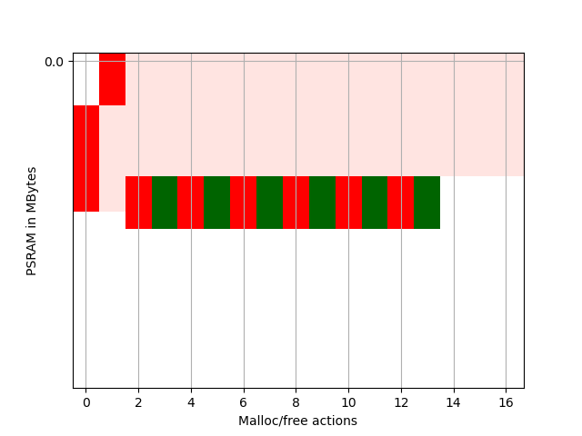
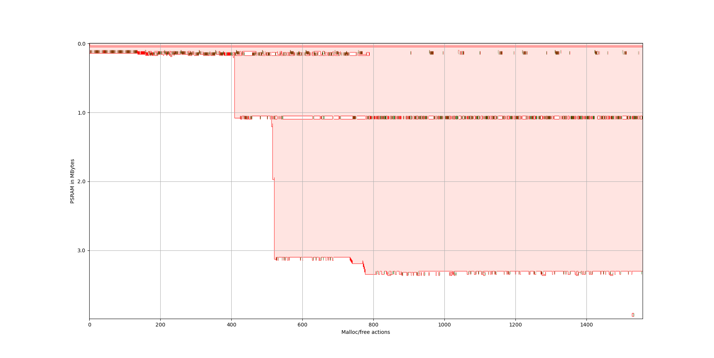

# PSRAM Usage Visualizer
This is a tool to visualize the PSRAM usage on a ESP IDF project.

For it to work on ESP IDF 4.4, you need to patch the
`.platformio/packages/framework-espidf@3.40402.0/components/heap/heap_caps.c` file:
In `heap_caps_malloc()` add following before the return:
```c
    if ((caps & MALLOC_CAP_SPIRAM) == MALLOC_CAP_SPIRAM) {
        printf("PSRAM MALLOC %p, %d\n", ptr, size);
    }
```

In `heap_caps_free()` add following before `if (esp_ptr_in_diram_iram(ptr)) {`:
```c
    if ((ptr >= 0x3F800000) && (ptr <= 0x3FBFFFFF)) {
        printf("PSRAM FREE %p\n", ptr);
    }
```


Then build your firmware and let it run.

Log the console output into a file.
It will look like this:
```
I (3849) cam_hal: buffer_size: 32768, half_buffer_size: 4096, node_buffer_size: 2048, node_cnt: 16, total_cnt: 15
I (3849) cam_hal: Allocating 61440 Byte frame buffer in PSRAM
I (3849) cam_hal: cam config ok
I (3849) ov2640: Set PLL: clk_2x: 0, clk_div: 0, pclk_auto: 0, pclk_div: 8
PSRAM MALLOC 0x3f80f8b4, 55880
PSRAM MALLOC 0x3f800898, 12
PSRAM MALLOC 0x3f81d300, 512
PSRAM FREE 0x3f81d300
PSRAM MALLOC 0x3f81d300, 512
PSRAM FREE 0x3f81d300
PSRAM MALLOC 0x3f81d300, 512
PSRAM FREE 0x3f81d300
PSRAM MALLOC 0x3f81d300, 512
PSRAM FREE 0x3f81d300
PSRAM MALLOC 0x3f81d300, 512
PSRAM FREE 0x3f81d300
PSRAM MALLOC 0x3f81d300, 512
PSRAM FREE 0x3f81d300
PSRAM MALLOC 0x3f95b714, 921600
PSRAM MALLOC 0x3f95b714, 512
PSRAM FREE 0x3f95b714
PSRAM MALLOC 0x3f95b714, 819200
PSRAM MALLOC 0x3fa23718, 512
PSRAM FREE 0x3fa23718
PSRAM MALLOC 0x3fa23718, 1200956
PSRAM MALLOC 0x3fb48a58, 512
PSRAM FREE 0x3fb48a58
PSRAM FREE 0x3fa23718
PSRAM FREE 0x3f95b714
PSRAM MALLOC 0x3f95b714, 819200
PSRAM MALLOC 0x3fa23718, 512
PSRAM FREE 0x3fa23718
PSRAM MALLOC 0x3fa23718, 53328
PSRAM MALLOC 0x3fa3076c, 512
```

The tool only uses the `` and `` lines. The other lines will be ignored but are helpful as references.

After you have enough data, call `psram-log-parser.py` which parses the logfile and generates a csv table.
Then call `plot.py` to generate a plot.

Above example woulds show this:


Another example of the PSRAM usage in the [AI on the Edge Device](https://github.com/jomjol/AI-on-the-edge-device) project:

